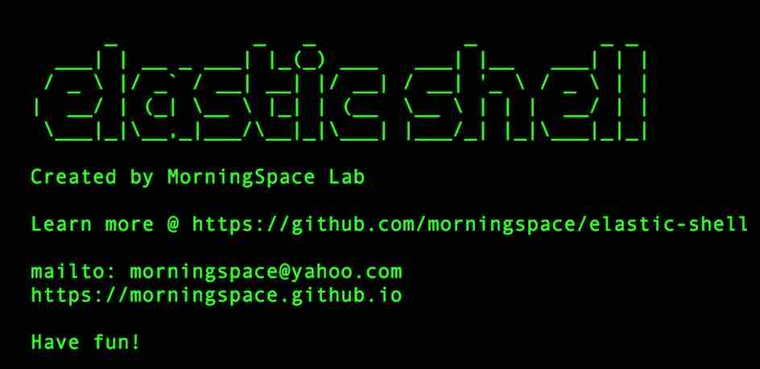
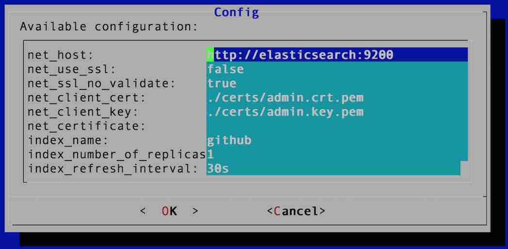

# Elastic Shell

Elastic Shell (or Elash in abbreviation) is a set of utilities that manage Elasticsearch and are purely written in Bash Shell.

It supports basic management of Elasticsearch index, snapshot, etc, and also provides assistance on some advanced Elasticsearch management tasks such as reindex, upgrade, etc.

Run `elash --help` from command line to learn more.

## How to run?

Elastic Shell can run either inside or outside Docker container.

The Docker image has installed Elastic Shell with all its dependencies, such as `curl`, `jq`, `dialog`, etc. Hence, you don't have to install them by yourself. To run in Docker container, simply pull the image from Docker Hub.
```
docker pull morningspace/elastic-shell
```

You can also run Elastic Shell without Docker. Since it's just a set of shell scripts, you can download and put it somewhere, create a soft link to `bin/main.sh`, or add into PATH environment variable, so that you can run it from anywhere.

## Interactive mode

Elastic Shell can be run not only as CLI command, but also in interactive mode, where it allows you to input values according to prompts and check outputs in interactive manner.

To run in interactive mode, you can specify either one of the below two options:

* --ui-text, the pure text-based user interface.



* --ui-dialog, the dialog-based user interface with better user interactive experience. It requires `dialog` to be installed as a dependency.



## Trouble Shooting

### Enable Logging

Elastic Shell uses `syslogd` to output its logs. When use the Docker image, it's been configured out of the box. Just run `syslogd` from command line in container, you will see the logs in `/var/log/elash.log`.

If not use the Docker image, you need to put the `etc/syslog.conf` under `/etc` then start `syslogd` by yourself.

### Dry Run

Some operations, e.g. to delete index, may be dangerous. To avoid mistake, you can run Elastic Shell in dry run mode before run in production environment.

To enable dry run, add option `--dry-run` when run Elastic Shell from command line. e.g.
```
elash index --dry-run delete github
```

Instead of sending request to server, it always returns the fake response. You can customize the response by modifying `config/dryrun.properties`. For each request, add the full path URL as key, and the designated fake response as value. When in dry run mode, Elastic Shell will find the entry that matches the request URL, and print the pre-defined response as if it's returned from server.

## Auto Completion

Elastic Shell supports auto completion when you type commands from command line.

The Docker image has installed `bash completion` and enabled this feature for you by default. To trigger it when you type commands, press two tabs, then it will give you the suggestions based on the context.

If not use the Docker image, you can run below command to source the completion definition script file from command line manually:
```
source bin/common/completion.sh
```

Or add it into ~/.bashrc so that can be enabled automatically anytime when you open a new terminal window.

## Dependencies

Elastic Shell has a few dependencies to make it work. You may need to install them by yourself if not use the Docker image. 

Most of the dependencies are optional. There will be alternatives or feature restricted if they are not installed.

|Dependency			|If Not Installed
|:----					|:----
|curl           |launch in dry run mode
|jq             |some features may not be available, e.g. JSON prettify
|dialog         |dialog mode disabled
|bash completion|commands auto completion disabled
