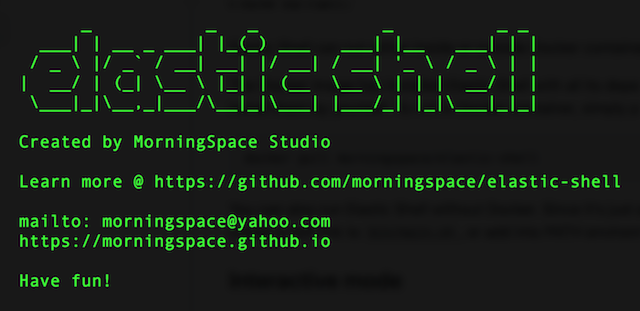

# Elastic Shell

Elastic Shell (or Elash in abbreviation) is a set of utilities that manage Elasticsearch and are purely written in Bash Shell.

It supports basic management of Elasticsearch index, snapshot, etc, and also provides assistance on some advanced Elasticsearch management tasks such as reindex, upgrade, etc.

Run `elash --help` from command line to learn more.

## How to run?

Elastic Shell can run either inside or outside Docker container.

The Docker image has installed Elastic Shell with all its dependencies, such as `curl`, `jq`, etc. Hence, you don't have to install them by yourself. To run in Docker container, simply pull the image from Docker Hub.
```
docker pull morningspace/elastic-shell
```

You can also run Elastic Shell without Docker. Since it's just a set of shell scripts, you can download and put it somewhere, create a soft link to `bin/main.sh`, or add into PATH environment variable, so that you can run it from anywhere.

## Interactive mode

Elastic Shell can be run not only as CLI command, but also in interactive mode, where it allows you to input values according to prompts and check outputs in interactive manner.

To run in interactive mode, you can specify the option `--ui-text`, which provides the pure text-based user interface.


